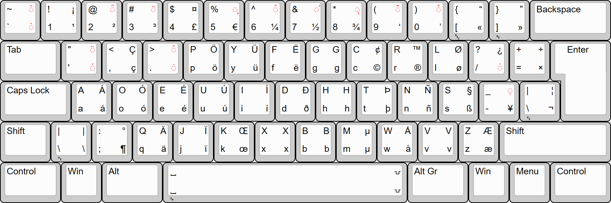

# Dvorak AltGr International Extended

This is a Windows port of the Linux/Unix implementation of Dvorak International, with dead keys moved to the AltGr and AltGr+Shift modifier states. 

Liberties taken: 
- superscript 1 has swapped positions with inverted exclamation mark
- dead hook has swapped positions with inverted question mark
- the generic currency symbol has swapped positions with the Pound Sterling sign
- dead tilde + `=` now yields `≈`, and the `≃` composition has been moved to dead tilde + `-` per AFNOR NF Z71-300

## Building
Compilation requires Microsoft Keyboard Layout Creator (MSKLC) which can be obtained from the link below: 
https://www.microsoft.com/en-us/download/details.aspx?id=102134
