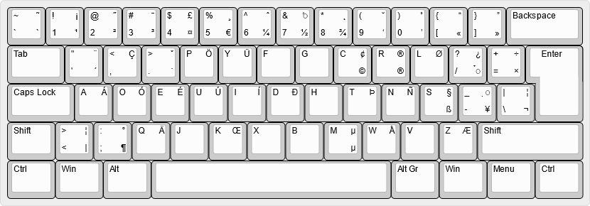

# dvorak-altgr-intl-extd
# Dvorak AltGr International

This is a Windows port of the Linux/Unix implementation of Dvorak International, with dead keys moved to the AltGr and AltGr+Shift modifier states. 

Liberties taken: 
- dead key placeholder symbols for tilde, circumflex, ring above, and macron use spacing modifier symbols
- since no spacing modifier letters exist for hook, dot below, or horn, all unapplicable characters on the keyboard have been given self-composing sequences (as opposed to using a random lookalike)
- dead hook followed by h or s each have capital counterparts from Latin Extended-D, which is something not currently defined by Xorg
- superscript 1 has swapped positions with invented exclamation mark, and dead hook has swapped positions with inverted question mark

# Building
Compilation requires Microsoft Keyboard Layout Creator (MSKLC) which can be obtained from the link below: 
https://www.microsoft.com/en-us/download/details.aspx?id=102134
