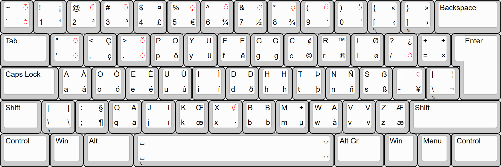

# Dvorak AltGr International Extended

This is a Windows port of the Linux/Unix implementation of Dvorak International, with dead keys moved to the AltGr and AltGr+Shift modifier states. 

Liberties taken: 
  * Changes from core layout:
    - Superscript 1 has swapped positions with inverted exclamation mark.
    - Dead hook has swapped positions with inverted question mark.
    - The generic currency symbol has swapped positions with the Pound Sterling sign.
  * Various dead key QOL optimizations:
    - Additional diacritics available from existing dead keys:
      - Dead macron also functions as dead belowmacron.
      - Dead ogonek also functions as dead belowcomma.
      - Many mathematical symbols are able to be produced via dead key sequences.
    - Changes to output from XOrg:
      - Dead acute + `Ó`/`ó`/`Ú`/`ú` produces `Ő`/`ő`/`Ű`/`ű`.
      - Dead abovedot + `U`/`u` produces `Ů`/`ů`.
      - Dead hook + `N`/`n` produces Eng (`Ŋ`/`ŋ`).
      - Dead hook + AltGr + `Y`/`y` produces `Ƴ`/`ƴ`.
      - Dead tilde + `=` produces `≅`.
      - Dead stroke + `U`/`u` produces `Ꞹ`/`ꞹ`.

## Building
Compilation requires KbdEdit which can be obtained [here](http://www.kbdedit.com/).
